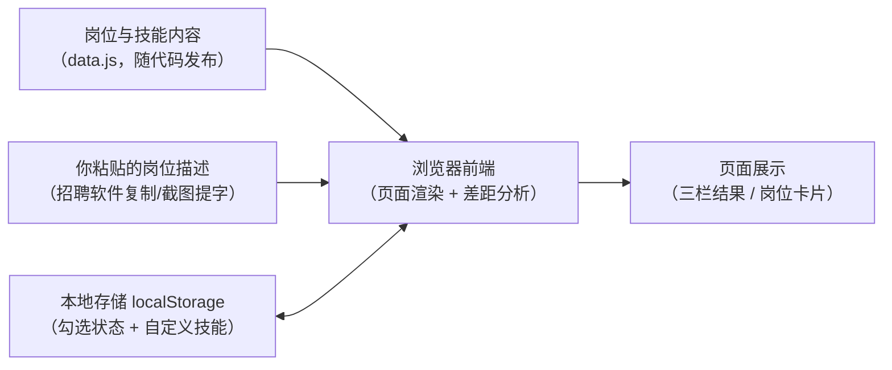

# offer-coach 技术设计（TECH_DESIGN.md）

> 撰写日期：2026-09-18｜阶段：Vibe Coding 五步工作流 第 3 步前置（技术路线）
> 依据：`PRD.md`（Day 4）。本文档回答「怎么做」，不改变 PRD 的「做什么」。
> **状态说明**：作者已确认路线 A（2026-09-18）。CloudBase 为课程既定安排——**第 15 天起按附录 M 接入**，届时以当天任务清单和附录 M 手册为准实施。

## 一、候选方案比较（2-3 套）

比较维度：前端怎么做 / 差距分析怎么实现 / 后端与数据库 / 部署上线。

### 路线 A：纯前端静态站（推荐默认）

| 项 | 选什么 |
|---|---|
| 前端 | 原生 HTML + CSS + JavaScript，多页面（4 个 html 对应 PRD 的 4 个页面），**不用框架、不用构建工具** |
| 差距分析 | **纯前端关键词匹配**：把岗位描述文字和技能总表的技能名（含别名）做对照，命中的即「识别出的要求」 |
| 后端 / 数据库 | **无**。用户数据存浏览器 localStorage |
| 部署 | GitHub Pages（仓库已就绪，Day 2 建好的 `offer-coach` 仓库直接开启） |

- **优点**：零成本、零账号、零密钥；PRD 的 12 条验收标准全部可达成；代码量最小，28 天内风险最低；分析结果天然「可解释」（命中了哪个词一目了然，正好满足 PRD 验收第 6 条）
- **代价**：分析「智能」程度有限——JD 里换个说法（如「熟悉 ES6」对不上「JavaScript」）就识别不到，需要靠技能别名表缓解；数据换设备即失；没有 AI 能力
- **适合**：本期 MVP。与 PRD「无登录、本地存储、28 天」三项约束完全吻合

### 路线 B：纯前端 + AI 接口（路线 A 的升级方向）

| 项 | 选什么 |
|---|---|
| 前端 | 同路线 A |
| 差距分析 | 调用大模型 API 读岗位描述，返回结构化结果（识别出的技能要求 + 出处） |
| 后端 / 数据库 | **需要加一个极简后端代理**（如 CloudBase Node.js 云函数）：API 密钥不能写进网页（谁打开都能偷走），必须锁在服务端；进度数据仍可留 localStorage |
| 部署 | 前端仍 GitHub Pages，云函数在 CloudBase |

- **优点**：识别能力强，换个说法也能认出来；理解语义（「负责页面性能优化」→ 前端性能技能）
- **代价**：要开通云服务账号、管理密钥（呼应「密钥永不进代码」规则）；有调用次数/费用；分析结果依赖模型质量；工期 +2~3 天；**本期从「无后端」变「有后端」**
- **适合**：第 15 天起的升级方向（届时结合课程安排决定是否启用 AI 分析）。本期不选的主因：PRD 验收标准（三栏、可解释）用关键词匹配已能达成，不值得为「更聪明」在 28 天内背上密钥和服务运维

### 路线 C：全栈示范路线（课程示范样板，本期不用）

| 项 | 选什么 |
|---|---|
| 前端 | React + Vite（组件化开发，需要 Node.js 构建工具链） |
| 差距分析 | 后端云函数实现（前端调 API） |
| 后端 / 数据库 | CloudBase Node.js 云函数 + CloudBase PostgreSQL |
| 部署 | CloudBase 静态网站托管 |

- **优点**：最完整的前后端分工样板；岗位内容可以做成「后台随时增删」（不用改代码发版）；为多用户、多设备同步铺好路
- **代价**：引入构建工具链、数据库设计、云服务账号与费用——**每一样都超出本期 PRD 的需要**（PRD 明确无账号、数据本地、单人使用）；工期至少多一周，Day 7 MVP 必然完不成
- **适合**：**课程第 15 天起按附录 M 接入的既定路线**（以当天任务清单和附录 M 手册为准，本文档作者尚未读过附录 M，届时照做）。第 5-14 天不使用；第十节写「从路线 A 迁移到 C 时受影响的文件」

### 结论：本期选路线 A

**核心理由一句话**：路线 A 是唯一一个「零新增依赖、零新增费用、零密钥风险」且能完整达成 PRD 12 条验收标准的方案；B 和 C 的优势（更聪明的识别、后台管理内容）对应的用户需求在 PRD 里都不存在，属于为不存在的需求付成本。B 的 AI 识别和 C 的云服务能力对应**课程第 15 天起的 CloudBase 阶段**（接入方式见附录 M），迁移路径见第十节。

## 二、项目结构（路线 A）

```
offer-coach/
├── index.html              # P1 首页（=岗位清单页）
├── job.html                # P2 岗位详情页（?job=前端开发 传参）
├── analyze.html            # P3 差距分析页
├── profile.html            # P4 我的进度页
├── css/
│   └── style.css           # 全站样式（响应式规则也在这）
├── js/
│   ├── data.js             # 岗位清单 + 技能总表（静态内容，含学习阶段/别名/关联岗位）
│   ├── storage.js          # localStorage 读写封装（唯一的存储出入口）
│   ├── analyze.js          # 差距分析逻辑（关键词匹配；独立成模块便于未来换 AI）
│   └── app.js              # 各页面的渲染与交互
├── index.html 内联结构      # 无构建工具，直接双击/托管即可运行
└── PRD.md / research.md / TECH_DESIGN.md / AGENTS.md
```

**结构原则**：存储只经 `storage.js` 一个口（将来迁移数据库时只改这一个文件）；分析只经 `analyze.js` 一个模块（将来换 AI 时只换它）；内容只写在 `data.js`（将来搬进数据库时只搬它）。

### 2.1 视图结构与切换方式（Day 13 补充）

**切换方式：多文件 URL 跳转（MPA）**。每个视图是一个独立 `.html` 文件，切换靠 `<a>` 链接改变地址栏，浏览器整页跳转；带数据的跳转用 URL 查询参数（`?job=岗位名`）。

**视图切换关系**（4 个视图，6 条链路；实线前进、虚线返回）：

| 从 | 到 | 触发方式 | 传参 |
|---|---|---|---|
| 首页 index.html | 岗位详情 job.html | 点岗位卡片 | `?job=岗位名` |
| 岗位详情 job.html | 首页 index.html | 返回链接「← 返回岗位清单」 | 无 |
| 岗位详情 job.html | 差距分析 analyze.html | 按钮「用这个岗位做差距分析 →」 | `?job=岗位名` |
| 首页 ⇄ 差距分析 / 首页 ⇄ 我的进度 / 差距分析 ⇄ 我的进度 | | 顶部导航栏（当前页高亮）+ 返回链接 | 无 |

**没选的两种方式**：单文件 hash 切换（需自写视图管理器，四页合并难维护）、路由库（需先上框架，违反路线 A）。

**选它的理由**：① 零新增依赖，只用 HTML 天生的 `<a>`；② 每页有真实地址，可收藏可分享，状态在地址栏一目了然；③ 传参分工清楚——「哪个岗位」走 URL 参数，「勾了哪些技能」走 localStorage（`storage.js` 统一出入口），页面切换不碰数据。

**已知代价**：每次切换整页刷新（对本工具无感）；顶部导航栏在 3 个 html 里各写一份，改一处需同步三处（靠自律维护）。

## 三、数据模型

与 PRD 第六节一致，落地为两类：**随代码发布的静态内容**和**浏览器本地存储的用户数据**。

**静态内容（js/data.js 中，随代码更新）**：

```
jobs: [{ name, intro, duty, requiredSkills: [skillName...] }]
skills: [{ name, category, stage(基础/进阶/高级), note, aliases: [别名...], relatedJobs: [jobName...] }]
```

**本地存储（localStorage，两个 key）**：

| key | 内容 | 示例 |
|---|---|---|
| `oc_progress` | 各技能的勾选状态 | `{"JavaScript": true, "Git": false}` |
| `oc_custom_skills` | 自定义技能数组（同技能字段，relatedJobs 可空，stage 默认「进阶」） | `[{"name":"Kubernetes","category":"工具","note":"...","stage":"进阶","aliases":[]}]` |

读写规则：勾选即写入、页面加载即恢复（对应 PRD 验收第 3 条）；读取失败或为空时按「全部未勾选」默认状态运行（对应 PRD 验收第 9 条）。

### 3.1 数据 ↔ 页面 ↔ 读写出口对照表

每份数据「显示在哪、谁读写、将来接口替代是什么」一表查清：

| 数据 | 显示在哪个页面 | 本期读写出口 | 将来的 API 替代 |
|---|---|---|---|
| jobs 岗位清单 | P1 首页（卡片）、P2 详情页 | data.js 随页面加载（只读） | `GET /api/jobs`（路线 C） |
| skills 技能总表 | P2 详情页（技能清单+勾选框）、P3 分析（比对基准） | data.js（只读） | 随 `/api/jobs` |
| oc_progress 勾选状态 | P2 勾选框回显、P4 我的进度、P3 分析的「我的进度」输入 | storage.js → localStorage | `GET/PUT /api/progress` |
| oc_custom_skills 自定义技能 | P4 我的进度、P3 分析 | storage.js → localStorage | 并入 `/api/progress` |
| 分析输入（粘贴的 JD） | P3 分析页（文本框） | 仅内存，不存储 | `POST /api/analyze`（路线 B） |
| 分析结果（三栏） | P3 分析页 | 仅显示，不存储 | — |

## 四、API 列表

**本期：无。** 没有后端就没有 API——所有逻辑在浏览器内完成。

**预留接口设计**（迁移路线 B / C 时启用，现在只占名不实现）：

| 接口 | 方法 | 用途 | 启用条件 |
|---|---|---|---|
| `/api/analyze` | POST | 接收岗位描述文本，返回识别出的技能要求与出处（AI 实现，密钥在服务端） | 升级路线 B |
| `/api/jobs` | GET | 从数据库拉取岗位清单（替代 data.js） | 迁移路线 C |
| `/api/progress` | GET/PUT | 用户进度云端同步（需要先有账号体系） | 更远期 |

## 五、数据流（对应 PRD「数据从哪来、到哪去」）



**一句话版本**：数据从三处来——随代码发布的岗位内容、用户粘贴的岗位描述、用户的历史勾选；全部在浏览器内被差距分析逻辑加工；结果展示在页面上，需要记住的部分（勾选、自定义技能）写回本地存储。**没有任何数据离开这台设备的浏览器**。

板块③ 会附这张图的正式版并逐条讲解。

## 六、错误处理（技术层落实 PRD 第七节）

| 技术层异常 | 处理方式 |
|---|---|
| localStorage 不可用（隐私模式/被禁用） | `try/catch` 包住读写；失败时降级为「本次会话内存有效」+ 页面提示「当前模式下进度不会被保存」 |
| localStorage 数据损坏（JSON 解析失败） | 视为空数据，重置为默认状态并在我的进度页提示；不中断页面运行 |
| data.js 加载失败 | 页面显示「内容加载失败，请刷新重试」 |
| 分析输入为空 / <20 字 / 无识别结果 / 总表外技能 | 按 PRD 第七节 4 条规则执行（提示语直接复用） |
| 所有按钮 | 点击后必有可见反馈，禁止静默失败（PRD 全局要求） |

## 七、环境变量

**第 5-14 天：无环境变量。** 没有后端、没有第三方服务调用，也就没有密钥需要管理。

**第 15 天起（按附录 M 接入 CloudBase）**：API 密钥等敏感信息只放云函数的环境变量配置里，**永不写进前端代码、永不进 Git 提交**（`.gitignore` 的 `.env` 规则 Day 2 已备好）。

## 八、迁移注意事项（路线 A → B / C 时受影响的文件）

| 未来变化 | 受影响文件 | 不受影响的 |
|---|---|---|
| 关键词匹配 → AI 接口（路线 B） | 只改 `analyze.js`（换成调用 `/api/analyze`）+ 新增云函数 | 页面、storage.js、data.js 全部不动 |
| localStorage → 云端同步 | 只改 `storage.js`（读写出口换成 API） | analyze.js、data.js 不动 |
| 静态 HTML → React/Vite（路线 C） | 4 个 html 变成组件；data.js 变成 JSON 数据文件或数据库表 | 业务逻辑（分析规则、存储结构）可平移 |
| 内容进数据库 + 后台管理（路线 C） | data.js 退役 → `/api/jobs`；新增管理页面 | storage.js、analyze.js 逻辑不变 |
| GitHub Pages → CloudBase 托管 | 无代码改动，只换部署配置 | 全部 |

**迁移总原则**：因为本期坚持「单入口」结构（存储一个口、分析一个模块、内容一个文件），路线升级时**换的是模块，不是重写项目**。

## 九、待确认问题与临时假设

| # | 问题 | 临时假设（本文档当前采用） | 确认方式 |
|---|---|---|---|
| 1 | 差距分析用关键词匹配（A）还是 AI（B）？ | **关键词匹配**（作者已确认，2026-09-18）；第 15 天 CloudBase 阶段是否升级为 AI 分析，按当天任务清单再定 | 已拍板 |
| 2 | CloudBase 云服务账号何时开通？ | **第 5-14 天不开通**（路线 A 用不到）；第 15 天按附录 M 注册开通（手册内容以附录 M 为准） | 已按课程教学文档确认 |
| 3 | 岗位卡片数量与内容（6-8 个具体是哪些） | 前端/后端/测试/数据分析/运维 + 作者补充 | Day 6+ 内容整理时作者勾选 |
| 4 | 自定义技能的「学习阶段」取值 | 默认「进阶」（Day 4 自检时留下的边缘问题） | 可随时改 |

## 十、方案变化影响速查

| 如果改选… | 需要新做的事 | 本文档需改的章节 |
|---|---|---|
| 路线 B（加 AI） | 开通云服务、写云函数、管理密钥、工期 +2~3 天 | 一/二/四/五/七 节 |
| 路线 C（全栈） | 引入构建链、数据库设计、账号体系，工期 +1 周以上 | 一至八节全部 |
| 维持路线 A | 无 | 无（当前状态） |
